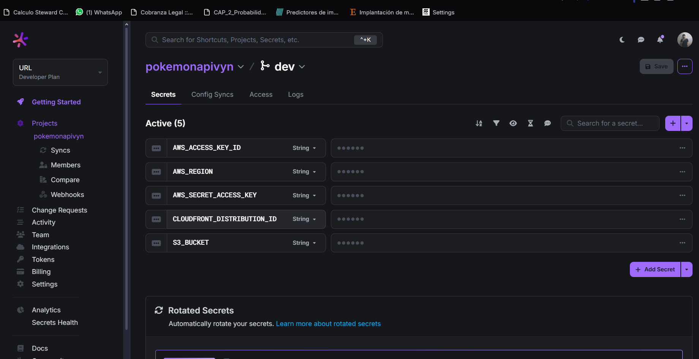
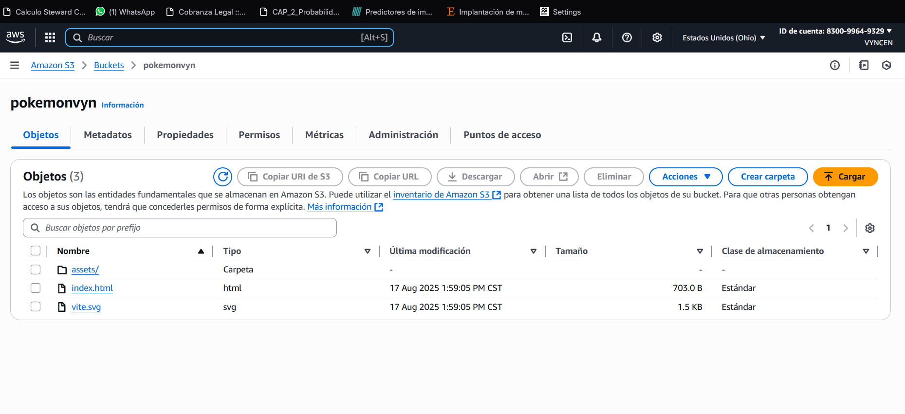
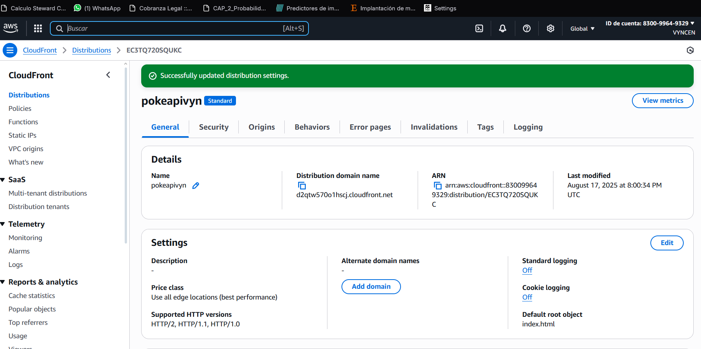
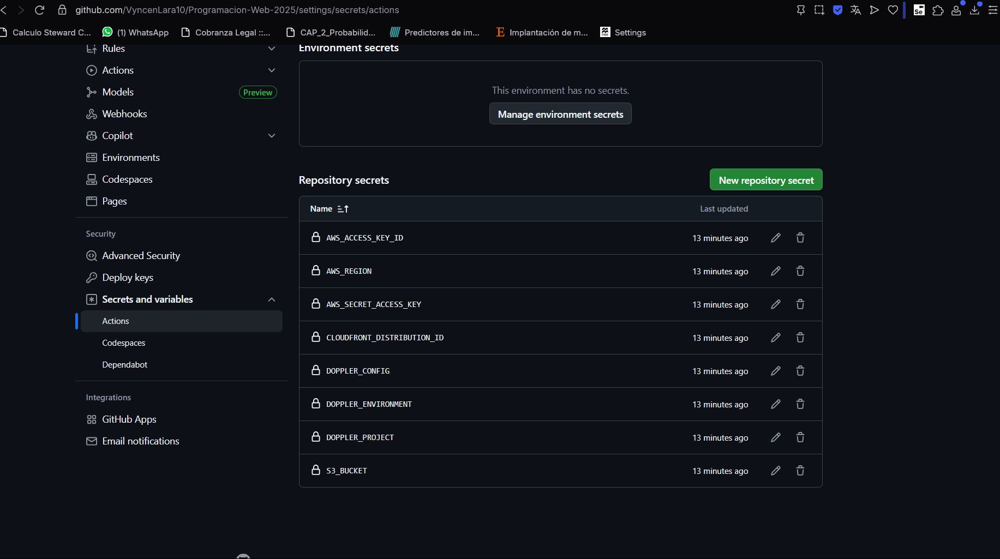

# Pokémon Gallery (Vite + PokeAPI + AWS + GitHub Actions)

Runtime data from [PokeAPI](https://pokeapi.co/).

## Tech Stack
- Vite (vanilla TS)
- GitHub Actions
- AWS S3 + CloudFront
- Doppler (secrets & GitHub Config Sync)

## Public URL (CloudFront)
- http://d2qtw570o1hscj.cloudfront.net

## Screenshots (required)
- Doppler → **Config Syncs** 

- Doppler → **Variables** (values redacted)


- GitHub → **Settings → Secrets and variables → Actions**


## How to run locally
```bash
npm install
npm run dev
