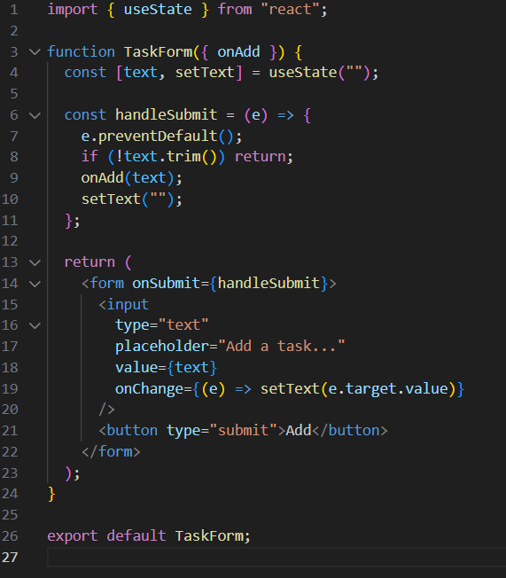
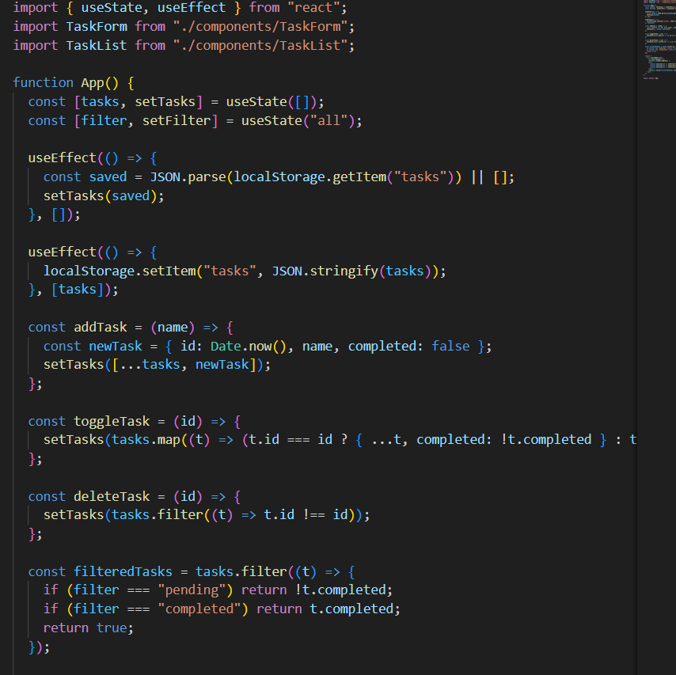

# Task Manager App

## Hooks used
- **useState**: to manage the state of tasks and filter.
- **useEffect**: to sync tasks with `localStorage` on load and whenever tasks change.

## Features
- Add tasks (default: pending)
- Mark tasks as completed/pending
- Delete tasks
- Filter tasks (all / pending / completed)
- Persistence with `localStorage`

## Deployment
- CI/CD pipeline with GitHub Actions and Doppler
- Built with Vite
- CDN: CloudFront  

## URL de CloudFront:  
https://d2l4d32ipylipq.cloudfront.net
