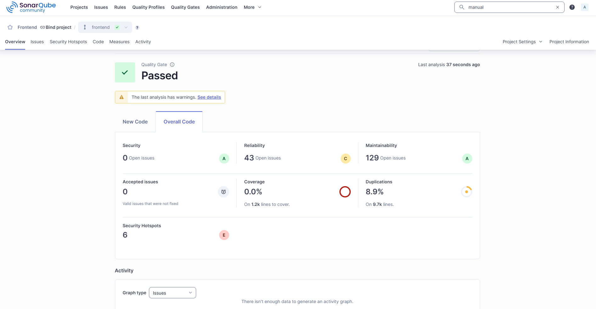
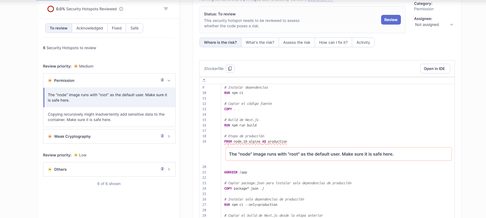
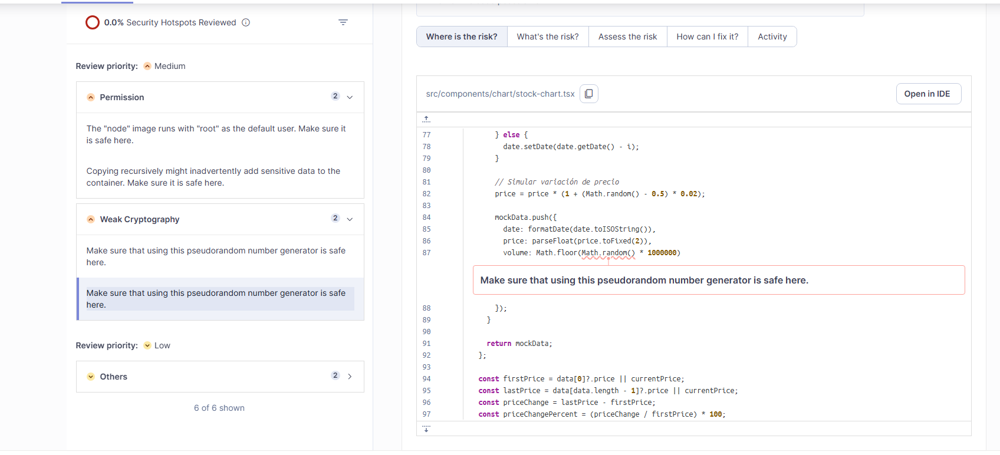
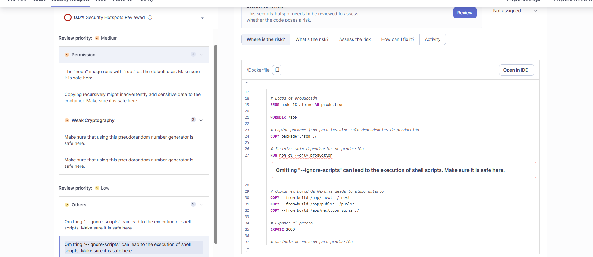
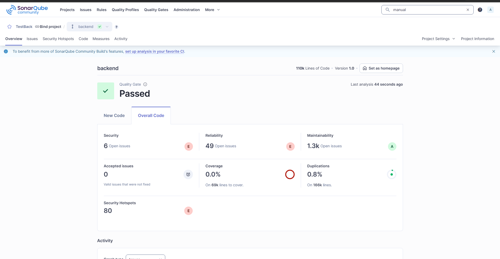
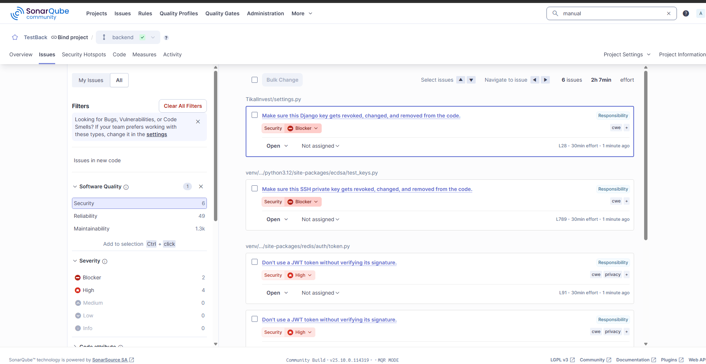
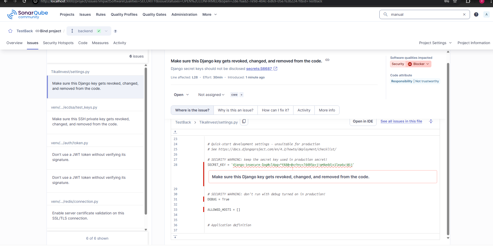
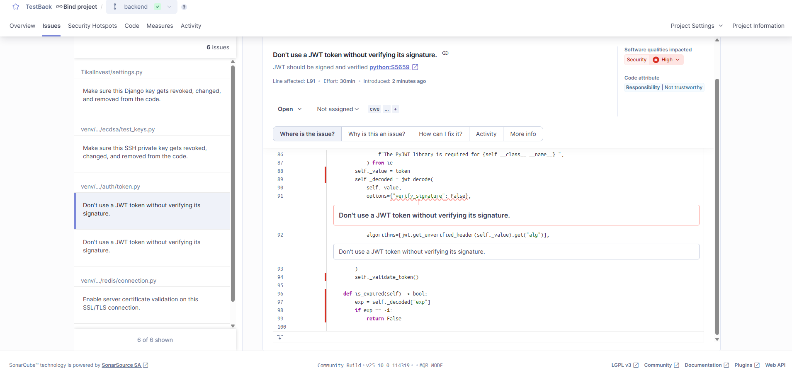
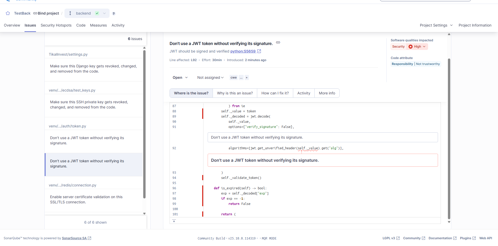

# HW-08 Vyncen Lara

## Configuration

Analisis of project of course 

### Start SonarQube
```bash
docker-compose up -d
```

open:  http://localhost:9000

## Results Test

### Frontend

#### Dashboard 


#### Vulnerabilities






### Backend

#### Dashboard 


#### Vulnerabilities






### Stop SonarQube
```bash
docker-compose down
```
### Re-escan proyect
```bash
cd frontend && sonar-scanner -Dsonar.host.url=http://localhost:9000 -Dsonar.login=sqp_b48ea5afb905824dfb53ba27ec179f1e64babbf7
cd ../backend && sonar-scanner -Dsonar.host.url=http://localhost:9000 -Dsonar.login=sqp_8b06aa56beee08be4533bd3858fab263367d9c57
```
### Look logs
```bash
docker-compose logs -f sonarqube
```